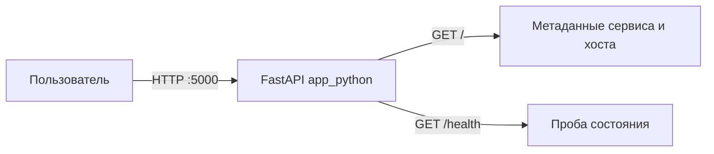

# Архитектура: эволюция сервиса

Сервис растёт от одного Python-процесса до системы в Kubernetes. Схема обновляется
на каждой фазе курса.

## Этап 1 — Лабораторная 1: один Python-сервис

```mermaid
flowchart LR
    U[Пользователь] -->|HTTP :5000| APP["FastAPI app_python"]
    APP -->|GET /| META["Метаданные сервиса и хоста"]
    APP -->|GET /health| PROBE["Проба состояния"]
```
